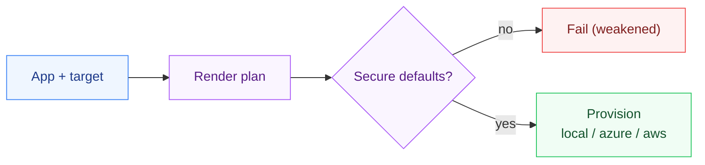

# DeployKit


**One command to deploy an LLM app into any customer environment.**

Forward Deployed Engineers waste days standing up an app in each customer's cloud or on-prem. DeployKit provisions a reference LLM app (like [LedgerRAG](../LedgerRAG)) into **local Kubernetes, Azure, or AWS** with **secure-by-default** settings - secrets management, TLS, and deny-all egress - and tears it down with one command.

## Quickstart

```bash
python -m deploykit.cli plan  --target local
python -m deploykit.cli up    --target azure --app ledgerrag
python -m deploykit.cli down  --target aws   --app ledgerrag
```

## Secure by default

Every plan runs security checks and **fails (non-zero exit) if you weaken them**:

```bash
python -m deploykit.cli plan --target aws --no-tls --allow-egress
#   SECURITY WARNINGS:
#     ! TLS disabled -- traffic would be unencrypted
#     ! egress not restricted -- data exfil risk
# exit code 1
```

- **Secrets** auto-routed to the right backend per target (K8s Secret / Azure Key Vault / AWS Secrets Manager).
- **TLS** on by default.
- **Deny-all egress** network policy by default.

## Targets

| Target | Provisions | Secrets |
|--------|-----------|---------|
| `local` | kind/minikube + Helm | K8s Secret |
| `azure` | Container Apps (Bicep) | Key Vault |
| `aws`   | ECS/Fargate (Terraform) | Secrets Manager |

Each target renders deterministic plans/manifests (testable without cloud creds); wire real `terraform apply` / `helm install` behind the same interface for production.

## Design notes

- **[DESIGN.md](DESIGN.md)** - the honest scope (a scaffold with a real target
  interface, not a working provisioner), the secure-by-default posture, and the
  non-goals.

## How it works



## Layout

```
deploy-kit/
├── deploykit/  the package - cli.py drives the one-command deploy
├── iac/        the infrastructure templates it renders
├── tests/      pytest suite
└── DESIGN.md   secure-by-default choices and the non-goals
```

## Part of [parag-labs](https://github.com/parag-labs)

Small, focused tools for building AI systems you can trust.

LedgerRAG · EvalForge · AgentGuard · PromptShield · **DeployKit**

## License

MIT
